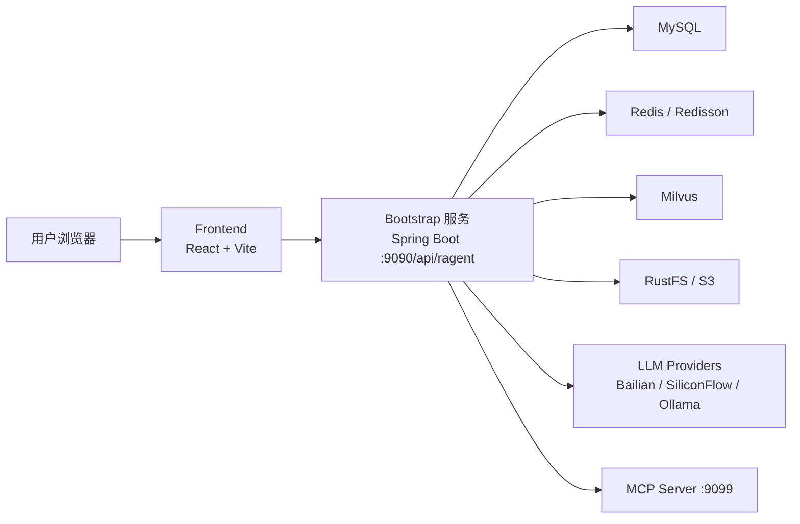
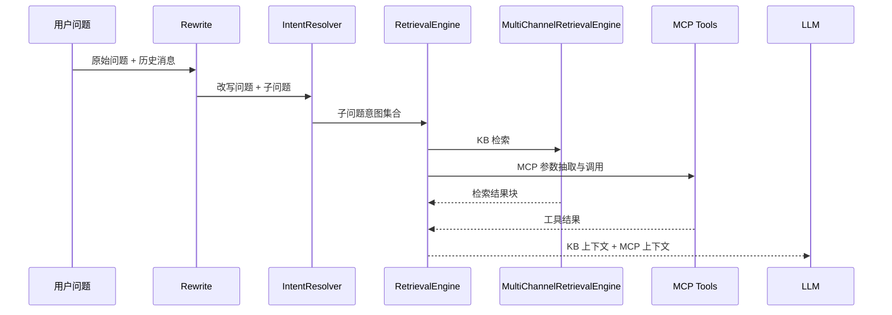
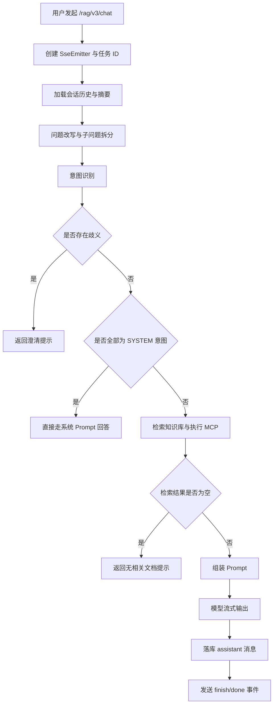

# Ragent 项目设计文档

## 1. 文档说明

### 1.1 文档目的

本文档用于沉淀 `Ragent` 当前代码实现对应的系统设计，帮助团队在以下场景中快速建立统一认知：

- 新成员入项与技术交接
- 架构评审与需求扩展
- 研发、测试、运维之间的协同
- 对外汇报、项目答辩、简历/方案材料整理

### 1.2 文档范围

本文档覆盖以下内容：

- 系统定位与建设目标
- 总体技术架构与模块划分
- 后端核心链路与关键设计
- 前端功能结构与页面组织
- 数据模型与核心表设计
- 运行依赖、部署方式与非功能设计

### 1.3 编写依据

本文档基于当前仓库现状编写，主要参考以下实现：

- 根目录 `README.md`
- 后端配置 `bootstrap/src/main/resources/application.yaml`
- 数据库脚本 `resources/database/schema_table.sql`
- 前端路由与状态管理 `frontend/src/router.tsx`、`frontend/src/stores/*`
- 问答、检索、入库、调度、追踪等核心服务实现

### 1.4 现状基线

截至当前仓库状态，项目包含：

- 后端 Java 主源码约 `324` 个文件
- 前端 `frontend/src` 下约 `82` 个源码文件
- 数据库初始化脚本约 `380` 行
- 文档目录已存在快速启动、多路检索等专题文档

本文档强调“按当前实现反推设计”，因此更偏重“已落地架构说明”，而非理想化蓝图。

## 2. 项目概述

### 2.1 项目定位

Ragent 是一个面向企业知识问答场景的 Agentic RAG 平台，目标不是提供单一的“向量检索 + 大模型回答”能力，而是提供一套覆盖知识入库、会话管理、问题改写、意图识别、多通道检索、MCP 工具调用、流式回答、后台运维和链路追踪的完整工程化方案。

### 2.2 目标用户

- 企业内部知识问答使用者
- 知识库管理员
- 平台运维与研发人员
- 需要通过 RAG + Agent 组合解决业务问题的团队

### 2.3 核心能力

- 支持知识库、文档、分块的全生命周期管理
- 支持会话式问答与 SSE 流式输出
- 支持多轮对话记忆与摘要压缩
- 支持问题改写与多子问题拆分
- 支持意图树分类、歧义澄清与系统级/知识库级路由
- 支持多通道检索与 Rerank 后处理
- 支持 MCP 工具调用，补足“查知识”之外的业务执行能力
- 支持文档按分块策略处理，或按 Pipeline 流水线处理
- 支持 URL 类文档定时拉取与自动重建
- 支持后台 Dashboard、RAG Trace、系统设置等运营视图

## 3. 设计目标与边界

### 3.1 设计目标

- 工程化：避免将 RAG 系统实现为单文件 Demo 或强耦合脚本
- 可扩展：检索通道、后处理器、MCP 工具、模型供应商、入库节点都可扩展
- 可观测：关键链路可记录 Trace 与执行状态
- 可运维：提供管理后台、任务列表、执行日志、系统设置视图
- 可降级：模型调用支持候选模型切换与失败回退
- 可控成本：通过摘要记忆、限流、并发控制降低资源消耗

### 3.2 当前边界

- 当前主体架构为前后端分离的单体应用，不是微服务拆分架构
- MCP 独立为轻量服务，但仍属于同一项目体系
- 认证采用 Sa-Token，权限模型当前以 `admin/user` 为主
- 部分配置仍以本地开发默认值存在于 `application.yaml`
- 模型侧已支持多供应商路由，但默认配置偏向本地推理场景

## 4. 总体架构设计

### 4.1 总体结构

项目采用前后端分离架构，后端按职责分为多个 Maven 模块，前端单独使用 React + Vite 构建。

### 4.2 模块划分

| 模块 | 类型 | 主要职责 |
| --- | --- | --- |
| `bootstrap` | 核心业务模块 | 启动类、控制器、RAG 业务、知识库、摄取流水线、用户、后台管理 |
| `framework` | 基础设施模块 | 通用异常、统一响应、SSE 封装、用户上下文、分布式 ID、幂等、Trace 上下文 |
| `infra-ai` | AI 基础能力模块 | LLM/Embedding/Rerank 客户端、模型路由、熔断、流式解析、Token 统计 |
| `mcp-server` | 独立工具服务 | JSON-RPC 风格 MCP Endpoint、工具注册与执行 |
| `frontend` | 前端模块 | 聊天端、管理后台、路由、状态管理、接口调用 |
| `resources` | 运维资源 | 数据库脚本、Milvus Docker Compose、格式化资源 |
| `docs` | 文档目录 | 快速启动、架构专题文档、示例请求 |

### 4.3 分层思路

后端整体遵循“业务编排层 + AI 基础能力层 + 通用框架层”的分工：

- `bootstrap` 关注业务域与流程编排
- `infra-ai` 屏蔽不同模型供应商的调用差异
- `framework` 提供和业务无关的横切能力

这种拆分使得模型路由、SSE、幂等、Trace、异常处理不需要散落在业务代码中。

## 5. 技术选型

### 5.1 后端技术栈

| 类别 | 选型 |
| --- | --- |
| 语言 | Java 17 |
| 框架 | Spring Boot 3.5.x |
| ORM | MyBatis-Plus |
| 鉴权 | Sa-Token |
| 缓存/并发控制 | Redis + Redisson |
| 向量数据库 | Milvus 2.6.x |
| 文档解析 | Apache Tika 3.2.x |
| 对象存储 | S3 SDK，目标存储为 RustFS |
| AI 能力 | 自研 LLM/Embedding/Rerank 接口抽象 |
| JSON/HTTP | Jackson、OkHttp |
| 线程上下文透传 | Transmittable Thread Local |

### 5.2 前端技术栈

| 类别 | 选型 |
| --- | --- |
| 框架 | React 18 |
| 构建工具 | Vite 5 |
| 语言 | TypeScript |
| 路由 | React Router |
| 状态管理 | Zustand |
| UI 组件 | Radix UI + 自定义组件 |
| 样式 | Tailwind CSS |
| 图表 | Recharts |
| HTTP | Axios |
| 提示反馈 | Sonner |

### 5.3 运行时依赖

| 组件 | 默认地址/端口 | 用途 |
| --- | --- | --- |
| Ragent API | `9090` | 主业务服务 |
| MCP Server | `9099` | MCP 工具服务 |
| MySQL | `127.0.0.1:3306` | 关系型业务数据 |
| Redis | `127.0.0.1:6379` | 认证、限流、分布式协调 |
| Milvus | `127.0.0.1:19530` | 向量检索 |
| RustFS | `localhost:9000` | 文档对象存储 |
| 本地模型服务 | `127.0.0.1:1234` | 默认本地推理入口 |

## 6. 业务域划分

### 6.1 会话域

负责用户对话、消息、摘要、反馈、示例问题等能力。

核心对象：

- 会话 `Conversation`
- 消息 `Message`
- 会话摘要 `ConversationSummary`
- 消息反馈 `MessageFeedback`
- 示例问题 `SampleQuestion`

### 6.2 知识域

负责知识库、文档、分块、向量索引、文档调度等能力。

核心对象：

- 知识库 `KnowledgeBase`
- 知识文档 `KnowledgeDocument`
- 知识分块 `KnowledgeChunk`
- 文档分块日志 `KnowledgeDocumentChunkLog`
- 文档调度 `KnowledgeDocumentSchedule`
- 调度执行记录 `KnowledgeDocumentScheduleExec`

### 6.3 意图与检索域

负责用户问题理解、意图树管理、检索策略与上下文组装。

核心对象：

- 意图节点 `IntentNode`
- 问题改写结果 `RewriteResult`
- 子问题意图 `SubQuestionIntent`
- 检索上下文 `RetrievalContext`
- 检索结果块 `RetrievedChunk`

### 6.4 摄取域

负责数据源到知识块的处理流水线。

核心对象：

- 摄取流水线 `IngestionPipeline`
- 流水线节点 `IngestionPipelineNode`
- 摄取任务 `IngestionTask`
- 摄取任务节点日志 `IngestionTaskNode`
- 摄取上下文 `IngestionContext`

### 6.5 运维与观测域

负责 Dashboard 指标、RAG Trace 链路记录、系统设置查询等能力。

核心对象：

- Trace 运行记录 `RagTraceRun`
- Trace 节点记录 `RagTraceNode`
- 系统设置视图 `SystemSettingsVO`

## 7. 后端详细设计

### 7.1 应用启动与扫描

启动类为 `com.pluszzz.ai.ragent.RagentApplication`，主要特征：

- 启用 Spring Boot 自动装配
- 启用定时任务 `@EnableScheduling`
- 启用 MyBatis Mapper 扫描
- 扫描业务、框架、AI、核心解析相关包

说明系统既包含实时问答能力，也包含后台周期任务能力。

### 7.2 接口层设计

控制器按业务域分组，典型接口包括：

| 控制器分组 | 主要接口 |
| --- | --- |
| 认证与用户 | 登录、登出、当前用户、用户分页、创建、修改、删除、修改密码 |
| 会话管理 | 会话列表、重命名、删除、消息列表 |
| 问答 | `/rag/v3/chat` SSE 流式问答、`/rag/v3/stop` 中止任务 |
| 知识库 | 知识库增删改查 |
| 文档 | 上传文档、触发分块、分页、搜索、查看分块日志 |
| 分块 | 分块列表、手工新增/更新/启停、批量启停、重建 |
| 意图树 | 树查询、节点增删改、批量启停/删除 |
| 摄取流水线 | Pipeline 增删改查、Task 创建/上传/分页/节点日志 |
| 追踪与后台 | Dashboard、RAG Trace 列表/详情、系统设置 |
| 示例问题 | 随机推荐、后台维护 |

接口返回统一通过 `Result` / `Results` 包装，便于前端以统一响应模型消费。

### 7.3 认证与上下文

认证使用 Sa-Token，设计特点如下：

- 全局拦截所有接口，`/auth/**` 和 `/error` 放行
- 异步调度请求和 `OPTIONS` 预检请求跳过登录校验
- `UserContextInterceptor` 将登录用户信息写入上下文
- 前端通过 `Authorization` 请求头传递 Token
- 当前初始化脚本内置管理员账号 `admin/admin`

当前实现更适合内部系统或演示环境，若进入生产，建议补齐密码加密、权限细分和审计策略。

### 7.4 会话记忆设计

会话记忆由 `ConversationMemoryService` 抽象，默认实现为 `DefaultConversationMemoryService`。

关键策略：

- 并行加载会话摘要与最近历史消息
- 追加消息后触发摘要压缩检查
- 摘要消息作为系统消息插入历史前部
- 通过 `history-keep-turns`、`summary-start-turns`、`summary-max-chars` 控制记忆规模

该设计兼顾了上下文完整性与 Token 成本。

### 7.5 问题改写与拆分

`MultiQuestionRewriteService` 是当前主要实现，承担：

- 查询词归一化
- LLM 驱动的问题重写
- 多子问题拆分
- 失败时回退为规则化拆分
- 支持读取最近 2 轮对话上下文辅助重写

输出结构为：

- `rewrittenQuestion`：改写后的主问题
- `subQuestions`：可并行处理的子问题列表

### 7.6 意图识别与歧义引导

意图体系采用树结构，底层存储于 `t_intent_node`。

设计特点：

- 从数据库加载意图树并缓存在 Redis
- LLM 读取叶子节点的路径、描述、示例后进行打分
- 分类结果按分数降序返回
- 当多个系统级选项分值接近时，触发澄清引导，而不是直接“硬猜”

意图节点支持三类能力：

- `KB`：知识库问答
- `SYSTEM`：纯系统交互
- `MCP`：外部工具执行

### 7.7 检索引擎设计

检索由 `RetrievalEngine` 统一编排，职责包括：

- 按子问题分别执行检索
- 区分 KB 意图与 MCP 意图
- KB 侧走多通道检索
- MCP 侧做参数抽取、工具调用和结果格式化
- 最终合并为给 LLM 使用的上下文

#### 7.7.1 多通道检索

多通道检索核心类为 `MultiChannelRetrievalEngine`。

已实现通道：

- `IntentDirectedSearchChannel`
  - 面向高置信度 KB 意图
  - 在特定知识库或集合中定向检索
  - 优先级高
- `VectorGlobalSearchChannel`
  - 面向无意图或低置信度场景
  - 在所有知识库集合中做全局向量搜索
  - 作为兜底召回通道

后处理器链已实现：

- `DeduplicationPostProcessor`
- `RerankPostProcessor`

设计上采用“通道并行 + 后处理串行”的结构，兼顾速度与可控性。

#### 7.7.2 检索流程

### 7.8 Prompt 组装设计

Prompt 构建由 `RAGPromptService` 负责，输入为 `PromptContext`，内容包括：

- 改写后的问题
- 子问题列表
- KB 上下文
- MCP 上下文
- 意图分组
- 历史消息

设计目标是将“检索与调用的结果”转换为结构化消息列表，而不是让业务层直接拼字符串。

### 7.9 流式输出设计

流式输出基于 `SseEmitter`，并通过 `SseEmitterSender` 做线程安全封装。

问答入口 `RAGChatController` 特征：

- `GET /rag/v3/chat`
- 返回 `text/event-stream`
- 通过 `deepThinking` 控制深度思考模式
- 通过 `conversationId` 复用会话

事件处理器 `StreamChatEventHandler` 会在流式过程中：

- 先发送 `meta` 事件，返回会话 ID 与任务 ID
- 分别发送 `think` 和 `response` 类型的增量消息
- 完成时落库 assistant 消息并发送 `finish`、`done`
- 根据会话情况补发自动生成的标题

### 7.10 问答限流与排队

`ChatQueueLimiter` 实现了全局并发控制与排队机制，属于系统工程亮点之一。

设计要点：

- 基于 Redis ZSET 维护排队顺序
- 基于 `RPermitExpirableSemaphore` 控制全局并发数量
- 通过 Lua 脚本做原子 claim
- 通过 Pub/Sub 通知排队唤醒
- 等待超时后自动返回拒绝消息
- 被拒绝请求同样会写入会话历史，保证体验闭环

这套机制避免高并发时直接压垮模型调用链路。

### 7.11 模型路由与容错

模型访问统一通过 `RoutingLLMService`、`ModelSelector`、`ModelRoutingExecutor` 协作完成。

设计要点：

- 支持 Chat、Embedding、Rerank 三类模型组
- 每组支持默认模型、候选列表、优先级和启停状态
- 深度思考模式优先选择支持 thinking 的候选模型
- 模型失败后自动切换下一个候选
- `ModelHealthStore` 维护模型健康状态
- `selection.failure-threshold` 与 `open-duration-ms` 形成熔断窗口

#### 7.11.1 流式首包保护

流式模式下引入 `FirstPacketAwaiter` 与 `ProbeBufferingCallback`：

- 下游回调先缓冲，不立刻向客户端发送
- 若首包成功，才一次性提交并持续透传
- 若当前模型首包失败、超时、无内容，则直接切换候选模型

该设计避免了“客户端先收到半截回答，随后模型切换导致内容污染”的问题。

### 7.12 文档与知识库管理

知识库由 `KnowledgeBaseServiceImpl` 管理，创建时会同步完成三件事：

- 写入 MySQL 知识库记录
- 创建 RustFS Bucket
- 创建对应 Milvus Collection

文档由 `KnowledgeDocumentServiceImpl` 管理，支持两种处理模式：

- `chunk`：按分块策略处理
- `pipeline`：按摄取流水线处理

文档来源支持：

- 文件上传
- URL 拉取

### 7.13 分块与向量化

分块流程具备以下特点：

- 使用分布式锁避免同一文档重复分块
- 异步线程池执行重型分块任务
- 可先清理旧分块和旧向量再重建
- 支持记录提取耗时、分块耗时、向量化耗时和总耗时

默认向量化存储设计：

- 每个知识库对应一个 Milvus Collection
- 向量维度默认 `4096`
- 索引类型 `HNSW`
- 距离度量 `COSINE`

Milvus 中单条记录包含：

- 主键 `doc_id`
- `content`
- `metadata`
- `embedding`

### 7.14 摄取流水线设计

摄取流水线由 `IngestionEngine` 执行，采用基于节点的链式编排方式。

设计特点：

- 节点定义存于数据库
- 节点间通过 `nextNodeId` 串联
- 支持条件表达式控制是否跳过节点
- 启动前校验起始节点、引用关系和环路
- 每个节点执行结果都会写入任务节点日志表

当前节点体系包括：

- `FetcherNode`
- `ParserNode`
- `EnhancerNode`
- `EnricherNode`
- `ChunkerNode`
- `IndexerNode`

这意味着系统已经具备“编排式知识加工链”的基础能力，而不是只能固定调用一套分块逻辑。

### 7.15 URL 文档定时刷新

URL 类文档支持调度刷新，调度信息存于 `t_knowledge_document_schedule`。

设计特征：

- 仅 URL 来源文档可启用调度
- 使用 Cron 表达式控制下一次执行时间
- 最小执行间隔可配置
- 记录最近成功时间、ETag、Last-Modified、内容哈希
- 支持调度锁字段，便于多实例场景下避免重复处理

### 7.16 RAG Trace 设计

Trace 通过注解 + AOP 实现。

关键实现：

- `@RagTraceRoot`：定义一条请求级链路
- `@RagTraceNode`：记录链路中的方法节点
- `RagTraceAspect`：负责 run/node 的开始、结束、异常、耗时记录
- `RagTraceContext`：基于上下文维护 traceId、节点栈

落库结果：

- `t_rag_trace_run`：记录一次完整运行
- `t_rag_trace_node`：记录每个节点的层级、状态和耗时

后台可直接查看某次问答的链路明细，便于排障与效果分析。

## 8. 核心流程设计

### 8.1 用户问答主流程

### 8.2 文档入库主流程

#### 8.2.1 分块模式

- 用户上传文件或登记 URL
- 系统创建文档记录，状态设为 `pending`
- 触发 `startChunk`
- 获取分布式锁并更新状态为 `running`
- 解析文档文本
- 执行分块策略
- 持久化块数据到 MySQL
- 写入 Milvus 向量索引
- 更新文档状态、分块数量和日志

#### 8.2.2 Pipeline 模式

- 用户选择已存在的 Pipeline
- 系统将文档或数据源转换为 `IngestionContext`
- `IngestionEngine` 按节点链执行
- 每个节点输出写入任务日志
- 最终结果更新任务表和节点表

### 8.3 取消生成流程

- 前端收到 `meta` 后获得 `taskId`
- 用户点击停止，调用 `/rag/v3/stop`
- `StreamTaskManager` 取消对应句柄
- 事件处理器在取消时落库已生成内容并结束流

### 8.4 反馈闭环流程

- 助手消息完成后，前端显示点赞/点踩入口
- 用户提交反馈写入 `t_message_feedback`
- 后台可用于质量分析和后续评估

## 9. 数据库设计

### 9.1 表分组

| 分组 | 相关表 |
| --- | --- |
| 会话与消息 | `t_conversation`、`t_message`、`t_conversation_summary`、`t_message_feedback` |
| 知识库 | `t_knowledge_base`、`t_knowledge_document`、`t_knowledge_chunk`、`t_knowledge_document_chunk_log` |
| 文档调度 | `t_knowledge_document_schedule`、`t_knowledge_document_schedule_exec` |
| 摄取流水线 | `t_ingestion_pipeline`、`t_ingestion_pipeline_node`、`t_ingestion_task`、`t_ingestion_task_node` |
| 意图与查询归一化 | `t_intent_node`、`t_query_term_mapping` |
| 观测与运营 | `t_rag_trace_run`、`t_rag_trace_node`、`t_sample_question` |
| 用户 | `t_user` |

### 9.2 核心关系

- 一个用户可拥有多个会话
- 一个会话包含多条消息
- 一个会话可对应多条摘要版本
- 一个知识库包含多篇文档
- 一篇文档包含多个分块
- 一篇 URL 文档可对应一个调度配置
- 一条摄取流水线包含多个节点配置
- 一次摄取任务包含多条节点执行日志

### 9.3 设计特点

- 所有表普遍带有 `create_time`、`update_time`、`deleted`
- 采用逻辑删除而不是物理删除
- Trace 和任务日志均做细粒度拆表，便于查询与审计
- 文档侧既保留结构化结果，也保留处理日志，便于回溯

## 10. 前端设计

### 10.1 路由结构

前端路由使用 `createBrowserRouter`，分为三类页面：

- 公共页面
  - `/login`
  - `*` 404
- 问答页面
  - `/chat`
  - `/chat/:sessionId`
- 管理后台
  - `/admin/dashboard`
  - `/admin/knowledge`
  - `/admin/knowledge/:kbId`
  - `/admin/knowledge/:kbId/docs/:docId`
  - `/admin/intent-tree`
  - `/admin/intent-list`
  - `/admin/intent-list/:id/edit`
  - `/admin/ingestion`
  - `/admin/traces`
  - `/admin/traces/:traceId`
  - `/admin/settings`
  - `/admin/sample-questions`
  - `/admin/users`

### 10.2 权限控制

前端通过三类路由守卫组件控制访问：

- `RequireAuth`
- `RequireAdmin`
- `RedirectIfAuth`

设计上和后端鉴权形成双重约束。

### 10.3 状态管理

Zustand 负责维护核心业务状态。

主要 Store：

- `authStore`
  - 登录、登出、获取当前用户、Token 持久化
- `chatStore`
  - 会话列表、当前会话、消息列表、流式状态、停止生成、反馈提交
- `themeStore`
  - 主题状态

### 10.4 聊天端设计

聊天页由以下组件组合：

- `MainLayout`
- `Sidebar`
- `MessageList`
- `MessageItem`
- `MarkdownRenderer`
- `ChatInput`
- `ThinkingIndicator`
- `FeedbackButtons`

前端通过 SSE 消费以下事件：

- `meta`
- `message`
- `reject`
- `finish`
- `done`

支持特性：

- 自动创建新会话
- 切换会话自动拉取历史消息
- 深度思考模式开关
- 中途停止生成
- 助手消息反馈

### 10.5 管理后台设计

`AdminLayout` 承载后台导航与内容区，菜单包括：

- Dashboard
- 知识库管理
- 意图管理
- 数据通道
- 链路追踪
- 用户管理
- 示例问题
- 系统设置

后台页面覆盖了“看结果、看过程、调配置、看指标”四类场景，已经具备平台化控制面的雏形。

### 10.6 接口消费设计

前端统一使用 `api.ts` 中的 Axios 实例：

- 自动从本地存储注入 Token
- 统一处理 `Result` 包装结构
- 统一识别登录失效并跳转登录页
- 全局 toast 提示错误信息

## 11. 非功能设计

### 11.1 并发与线程池

系统为不同负载类型配置了独立线程池，并通过 TTL 透传上下文。

当前显式线程池包括：

- `mcpBatchThreadPoolExecutor`
- `ragContextThreadPoolExecutor`
- `ragRetrievalThreadPoolExecutor`
- `ragInnerRetrievalThreadPoolExecutor`
- `intentClassifyThreadPoolExecutor`
- `memorySummaryThreadPoolExecutor`
- `modelStreamExecutor`
- `chatEntryExecutor`
- `knowledgeChunkExecutor`

这样做的意义：

- 避免所有异步任务争抢同一线程池
- 区分 IO 密集与 CPU 密集任务
- 在异步线程中保留用户上下文与 Trace 信息

### 11.2 容错与降级

系统已经实现多层次容错：

- 模型候选回退
- 模型熔断与健康状态管理
- 流式首包保护
- 检索通道失败隔离
- 后处理器失败跳过
- SSE 异常封装与安全关闭
- 文档重建前清理旧向量，降低脏数据风险

### 11.3 可观测性

当前可观测性覆盖：

- RAG Trace 运行链路
- 摄取任务与节点日志
- 文档分块日志
- Dashboard 汇总指标
- 消息反馈收集

可实现对“问答效果不好”“检索为空”“哪个节点慢”“哪次模型失败”这类问题进行快速定位。

### 11.4 安全设计

当前安全能力包括：

- Token 鉴权
- 后台角色控制
- CORS 显式允许本地开发源
- 文件上传大小限制
- 幂等提交控制
- 全局问答限流与排队

当前仍建议后续增强：

- 密码加密存储
- 更细粒度 RBAC
- 敏感配置环境变量化
- 审计日志与安全告警

### 11.5 可扩展性

系统以下扩展点已经具备较好设计：

- 新增模型供应商：实现 `ChatClient`/Embedding/Rerank 客户端
- 新增检索通道：实现 `SearchChannel`
- 新增检索后处理器：实现 `SearchResultPostProcessor`
- 新增 MCP 工具：实现工具定义与执行器
- 新增摄取节点：实现 `IngestionNode`
- 新增分块策略：扩展 `ChunkingStrategy`

## 12. 部署与运行设计

### 12.1 启动方式

后端采用 Spring Boot 启动：

- 构建：`./mvnw -DskipTests package`
- 运行：`./mvnw -pl bootstrap spring-boot:run`

前端采用 Vite 启动：

- 安装：`npm install`
- 运行：`npm run dev`

### 12.2 部署前置

- 初始化 MySQL 数据库
- 导入 `schema_table.sql`
- 可选导入 `init_data.sql`
- 启动 Redis
- 启动 Milvus
- 启动 RustFS 或兼容 S3 服务
- 准备本地或远端模型服务
- 如需 MCP 能力，启动 `mcp-server`

### 12.3 关键配置项

后端核心配置集中在 `application.yaml`，包括：

- `server`
- `spring.datasource`
- `spring.data.redis`
- `milvus`
- `rag.default`
- `rag.query-rewrite`
- `rag.rate-limit`
- `rag.memory`
- `rag.knowledge.schedule`
- `rag.mcp`
- `rag.search.channels`
- `rag.trace`
- `ai.providers`
- `ai.chat`
- `ai.embedding`
- `ai.rerank`
- `rustfs`
- `sa-token`

### 12.4 运行模式建议

- 开发模式：本地 MySQL + Redis + Milvus + 本地模型服务
- 联调模式：后端本地，模型走远端供应商
- 演示模式：使用内置管理员账号和本地默认配置
- 生产模式：建议将密钥、数据库、存储、模型地址全部外置到环境变量或配置中心

## 13. 当前实现特点总结

### 13.1 优势

- 架构已经超出 Demo 范畴，具备平台化雏形
- RAG、MCP、Pipeline、Trace、后台管理形成闭环
- 检索、模型路由、流式回退等工程设计较完整
- 数据模型覆盖广，便于后续运营与分析
- 前端和后端职责清晰，边界明确

### 13.2 当前约束

- 某些默认配置仍偏本地开发环境
- 密码与部分敏感配置需要进一步生产化
- 当前主要是单体部署，容量扩展依赖后续拆分或横向扩容
- Rerank 默认使用 `noop`，实际效果依赖后续接入真实重排模型

## 14. 后续演进建议

建议后续版本从以下方向演进：

- 增加 Elasticsearch ，实现真正混合检索
- 引入更细粒度权限模型，支持知识库级权限隔离
- 完善模型评估、命中率分析与反馈闭环
- 支持异步任务队列化，提高大文档处理吞吐
- 推动配置中心化与容器化部署模板标准化
- 为 Trace 增加可视化调用树与节点参数摘要

## 15. 结论

Ragent 当前已经形成一套较完整的企业级 RAG 平台实现。它的核心价值不在于单一功能点，而在于把知识管理、问题理解、检索编排、模型调用、工具执行、流式交互、任务处理、链路观测和后台运维组织成了一套可持续演进的工程体系。

从设计角度看，项目最重要的特征有三点：

- 用模块化分层把“业务编排”和“AI 基础能力”解耦
- 用多通道检索、模型路由、限流排队等机制保障系统稳定性
- 用 Trace、任务日志、后台视图把系统做成可运营、可分析、可维护的平台

因此，这份文档不仅可作为当前实现说明，也可以作为后续架构演进和团队协作的基线文档。
